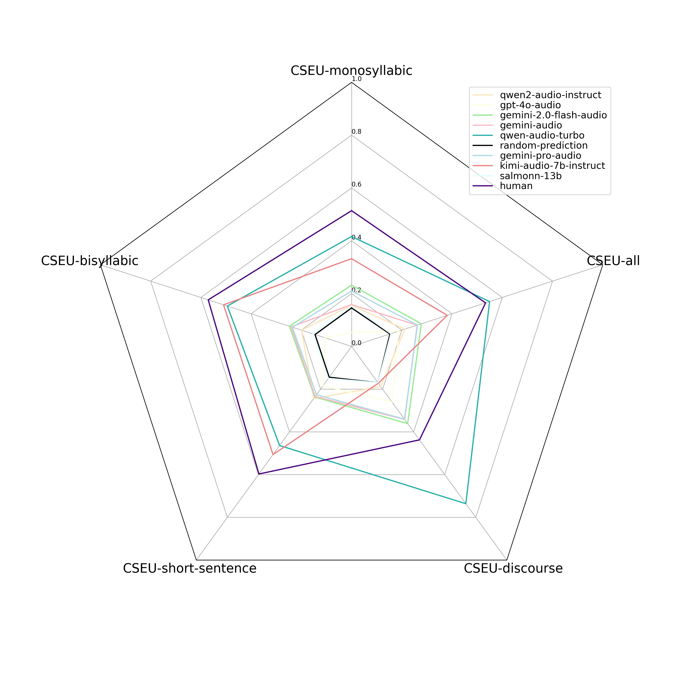
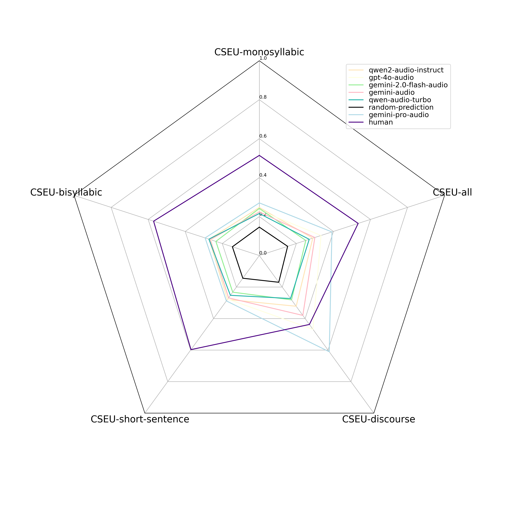

# CSEU-Bench: Multi-faceted LLM Evaluation on Chinese Speech Emotional Understanding with Pyscho-linguistic Labels

**The full dataset has been uploaded to huggingface at https://huggingface.co/datasets/smart9/CSEU-Bench.**

## To run evaluation on CSEU-Bench:

**0. Install required packages via `pip install -r requirements.txt`**

**1. Set api keys in const.py**

**2. Download the CSEU-Bench from huggingface, and place it under /data**

**3. Evaluating speech LLMs on CSEU-Bench**

---

**3.1 Run main_audio_cesu.py for zero-shot prompting**
- Main syntax: `python main_audio_cesu.py --model_name {MODEL_NAME} --dataset_name {CSEU_SUBSET_NAME}`
- Supported CSEU-subset:
    - CSEU-monosyllabic: `CSEU_SUBSET_NAME = single-syllable`
    - CSEU-bisyllabic: `CSEU_SUBSET_NAME = two-syllable`
    - CSEU-short-sentence: `CSEU_SUBSET_NAME = short-sentence`
    - CSEU-discourse: `CSEU_SUBSET_NAME = discourse`
    - CSEU-all: `CSEU_SUBSET_NAME = all`
- Supported Models:
    - **salmonn-13b**
        - `MODEL_NAME = salmonn-13b`
        - Runs locally. Check https://github.com/bytedance/SALMONN for downloading pretrained checkpoints. Set their paths correctly at `--salmonn_***` options.  
    - **kimi-audio-7b-instruct**
        - `MODEL_NAME = kimi-audio-instruct`
        - Runs locally. Check https://github.com/MoonshotAI/Kimi-Audio for downloading pretrained checkpoint. Set its path correctly at `--kimi_audio_instruct_model_dir` option.   
    - **qwen2-audio-7b-instruct**
        - `MODEL_NAME = qwen2-audio-instruct`
        - Runs locally. Check https://huggingface.co/Qwen/Qwen2-Audio-7B-Instruct for downloading pretrained checkpoint. Set its path correctly at `--qwen2_audio_instruct_model_dir` option.
    - **qwen-audio-turbo**
        - `MODEL_NAME = qwen-audio-turbo`
        - Proprietary model. We make API calls via [阿里云百炼](https://bailian.console.aliyun.com/). Requires dashscope API key (DASHSCOPE_API_KEY at utils/const.py)
    - **gemini-audio**
        - `MODEL_NAME = qwen-audio`
        - Gemini-1.5-Flash. We make API calls via [Gemini](https://ai.google.dev/gemini-api/docs/models). Requires Gemini API key (GEMINI_API_KEY at utils/const.py)
    - **gemini-pro-audio**
        - `MODEL_NAME = gemini-pro-audio`
        - Gemini-1.5-pro. We make API calls via [Gemini](https://ai.google.dev/gemini-api/docs/models). Requires Gemini API key (GEMINI_API_KEY at utils/const.py)
    - **gemini-2.0-flash-audio**
        - `MODEL_NAME = gemini-2.0-flash-audio`
        - Gemini-2.0-flash-experimental. We make API calls via [Gemini](https://ai.google.dev/gemini-api/docs/models). Requires Gemini API key (GEMINI_API_KEY at utils/const.py)
    - **gpt-4o-audio**
        - `MODEL_NAME = gpt-4o-audio`
        - We make API calls via [OpenAI](https://platform.openai.com/docs/models). Requires OpenAI API key (OPENAI_API_KEY at utils/const.py)
- By default, all results are stored under `/output_cseu`. You may set the path at `--output_folder` option.

---

**3.2 Run main_audio_cesu_fsl.py for few-shot prompting**
- Main syntax: `python main_audio_cesu_fsl.py --model_name {MODEL_NAME} --dataset_name {CSEU_SUBSET_NAME} --k {K_SHOT}`
- Supported CSEU-subset:
    - CSEU-monosyllabic: `CSEU_SUBSET_NAME = single-syllable`
    - CSEU-bisyllabic: `CSEU_SUBSET_NAME = two-syllable`
    - CSEU-short-sentence: `CSEU_SUBSET_NAME = short-sentence`
    - CSEU-discourse: `CSEU_SUBSET_NAME = discourse`
    - CSEU-all: `CSEU_SUBSET_NAME = all`
- Supported Models:
    - **qwen2-audio-instruct**
        - `MODEL_NAME = qwen2-audio-instruct`
        - Runs locally. Check https://huggingface.co/Qwen/Qwen2-Audio-7B-Instruct for downloading pretrained checkpoint. Set its path correctly at `--qwen2_audio_instruct_model_dir` option.
    - **qwen-audio-turbo**
        - `MODEL_NAME = qwen-audio-turbo`
        - Proprietary model. We make API calls via [阿里云百炼](https://bailian.console.aliyun.com/). Requires dashscope API key (DASHSCOPE_API_KEY at utils/const.py)
    - **gemini-audio**
        - `MODEL_NAME = qwen-audio`
        - Gemini-1.5-Flash. We make API calls via [Gemini](https://ai.google.dev/gemini-api/docs/models). Requires Gemini API key (GEMINI_API_KEY at utils/const.py)
    - **gemini-pro-audio**
        - `MODEL_NAME = gemini-pro-audio`
        - Gemini-1.5-pro. We make API calls via [Gemini](https://ai.google.dev/gemini-api/docs/models). Requires Gemini API key (GEMINI_API_KEY at utils/const.py)
    - **gemini-2.0-flash-audio**
        - `MODEL_NAME = gemini-2.0-flash-audio`
        - Gemini-2.0-flash-experimental. We make API calls via [Gemini](https://ai.google.dev/gemini-api/docs/models). Requires Gemini API key (GEMINI_API_KEY at utils/const.py)
    - **gpt-4o-audio**
        - `MODEL_NAME = gpt-4o-audio`
        - We make API calls via [OpenAI](https://platform.openai.com/docs/models). Requires OpenAI API key (OPENAI_API_KEY at utils/const.py)
- By default, all results are stored under `/output_cseu_fsl`. You may set the path at `--output_folder` option.

---

**3.3 Run random_prediction_cseu.py for random prediction (Chance-level performance)**

---

**4. Aggregate evaluation result.**

- Call `python aggregate_results_cseu.py`
- The summary of results can be found at `/summary_cseu` and `/summary_cseu_fsl`, respectively 
- Different depth values correspond to different hyperparameters `k` for the $Acc_k$ metric. The main result is produced with $Acc_5$ metric
- Breakdown tables present the result of breakdown analysis on CSEU-discourse

**5. Main experiment result:**

a) Zero-shot prompting:

b) Few-shot prompting:

